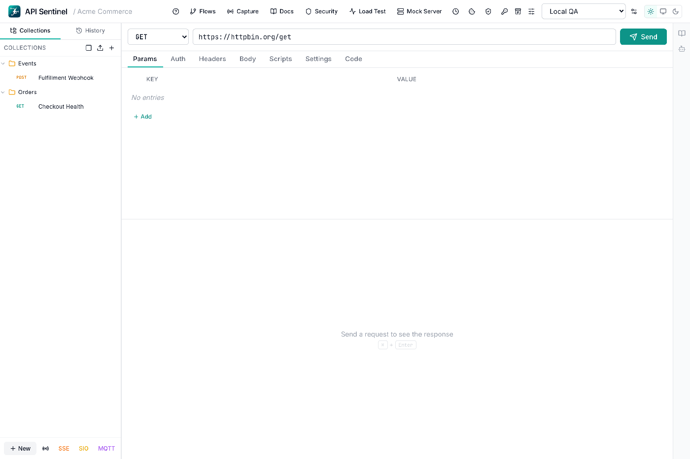
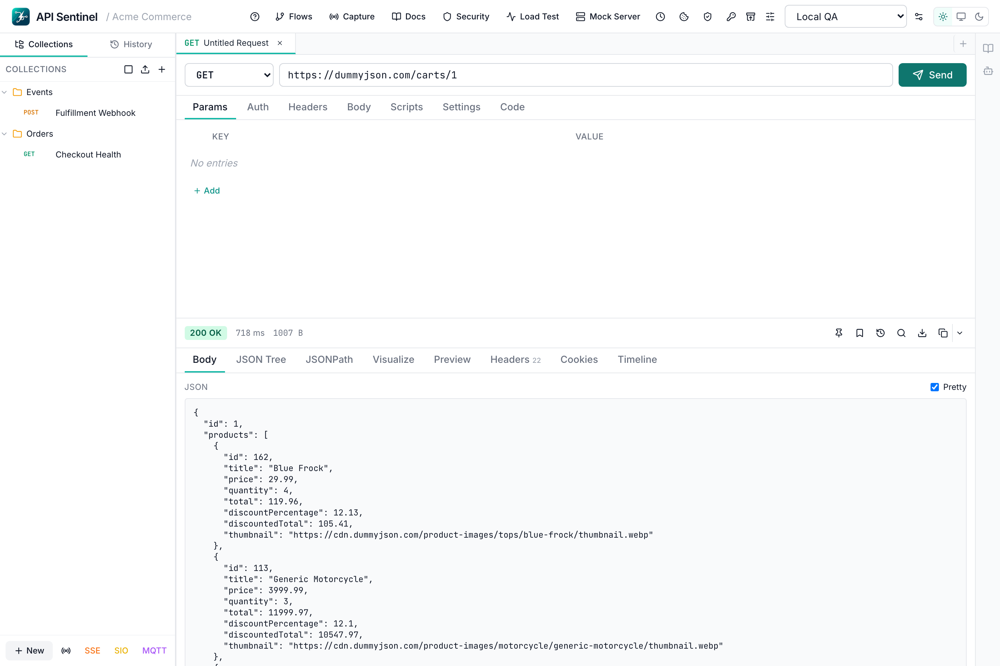
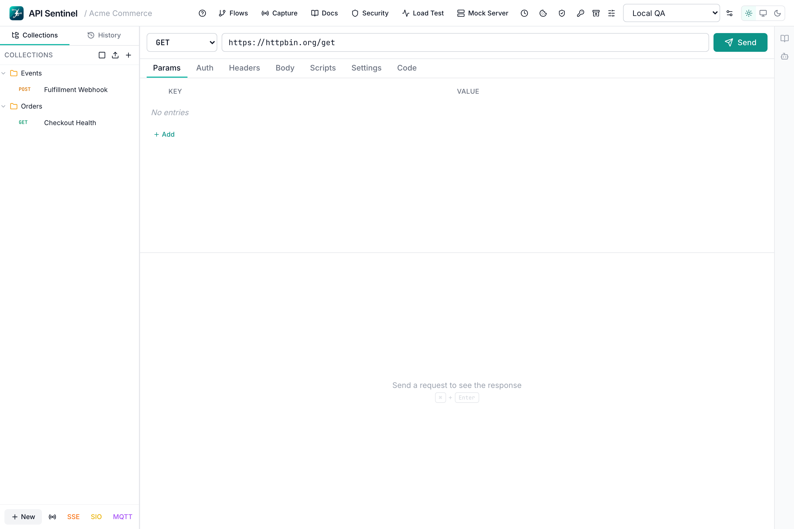
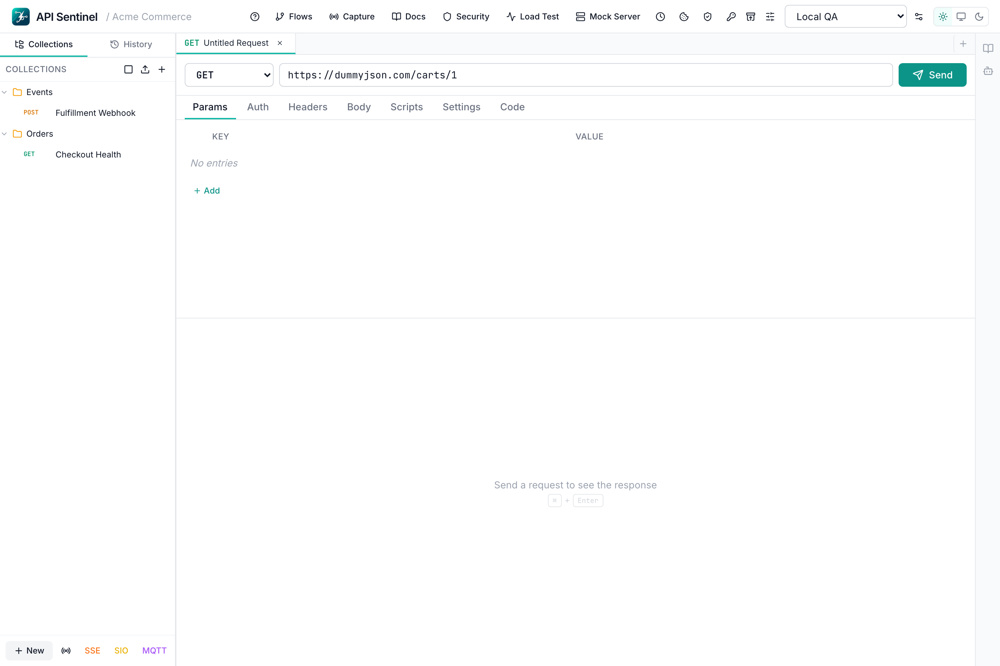
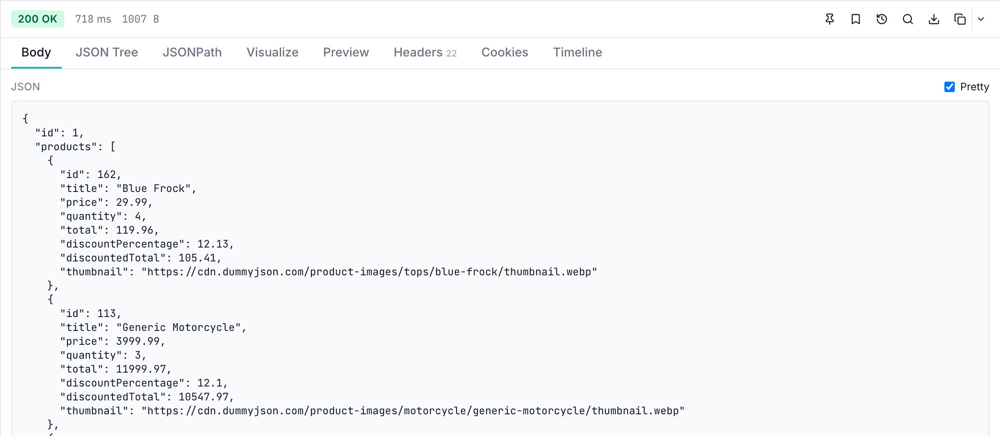
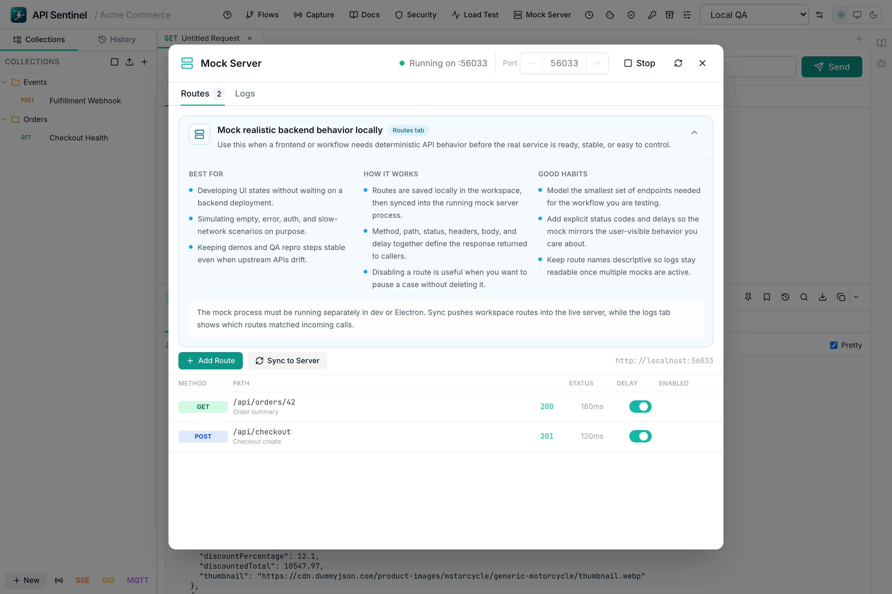
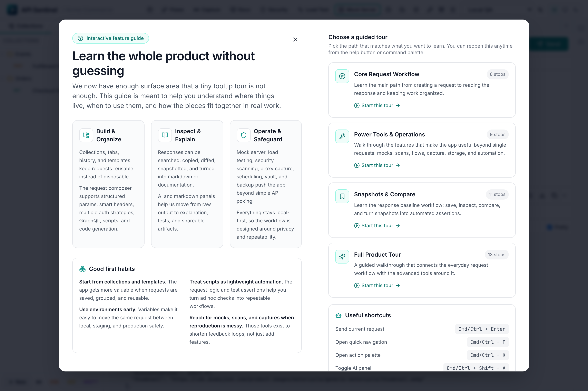

<p align="center">
  
</p>

# API Sentinel — Desktop API Testing, Mock Server, Load Testing, and Real-Time API Client


API Sentinel is a developer-focused desktop API client for REST API testing, GraphQL requests, collections, environments, request history, mock server workflows, load testing, security checks, and real-time protocol debugging. This repository is the public download and product page for API Sentinel. It does not contain application source code.

If you are searching for an API testing tool, HTTP client, REST client, GraphQL client, mock server, load testing tool, WebSocket client, or desktop API client for local-first development workflows, this repository is where you can read about the product and download the latest installers from GitHub Releases.

## Product Tour

The fastest way to understand the product surface is to watch the app move through the main workflow: organize requests, send a call, inspect the response, and jump into advanced tooling without leaving the workspace.



## Start Here

If this is your first time with API Sentinel, use these docs first:

- [Getting Started Guide](./docs/GETTING_STARTED.md)
- [Feature Overview](./docs/FEATURES.md)

Fast path for new users:

1. Download the installer for your platform.
2. Launch API Sentinel with no account setup required.
3. Paste a URL or full cURL command into the request bar.
4. Save the request into a collection and attach an environment.
5. Inspect the response, add tests, and save a snapshot if the result should become a baseline.
6. Open advanced tools only when you need them: mock server, load testing, security, flows, docs, proxy capture, and real-time protocol composers.

## Download

- Latest release: [Download API Sentinel from GitHub Releases](https://github.com/Sanjeevsky/api-sentinel-downloads/releases/latest)
- All releases: [View release history](https://github.com/Sanjeevsky/api-sentinel-downloads/releases)
- Current public release: `v0.0.1`

Each release can include platform installers such as:

- Windows: `.exe` for `x64`
- macOS: `.dmg` for Apple Silicon (`arm64`) and Intel (`x64`) when available
- Linux: `.AppImage` for `x64` and `arm64`

## Why API Sentinel

API Sentinel is built for developers who want a fast API client without unnecessary friction. It is designed for local-first API exploration, request replay, environment-based testing, mock-driven development, API automation, load testing, and day-to-day REST workflows.

Core positioning keywords, used honestly:

- API client
- REST client
- API testing tool
- HTTP client
- desktop API client
- GraphQL client
- mock server
- load testing tool
- WebSocket client
- API documentation tool
- local-first developer tools

API Sentinel is proprietary software. The source code remains private. This public repository exists for downloads, documentation, release notes, and trust material.

## Installation

### Windows (`.exe`)

1. Open the [latest release page](https://github.com/Sanjeevsky/api-sentinel-downloads/releases/latest).
2. Download the Windows installer file ending in `.exe`.
3. Run the installer.
4. If Windows SmartScreen appears, verify the publisher and checksum, then continue if appropriate for your environment.
5. Launch API Sentinel from the Start menu or desktop shortcut.

### macOS (`.dmg`)

1. Open the [latest release page](https://github.com/Sanjeevsky/api-sentinel-downloads/releases/latest).
2. Download the macOS installer file ending in `.dmg` for your Mac architecture.
3. Open the disk image and drag API Sentinel into `Applications`.
4. If Gatekeeper warns on first launch, use `Open` from the context menu or approve the app in `System Settings` -> `Privacy & Security`.
5. Launch API Sentinel from `Applications`.
6. Signed and notarized macOS releases remain the long-term target for the smoothest install experience.

### Linux (`.AppImage`)

1. Open the [latest release page](https://github.com/Sanjeevsky/api-sentinel-downloads/releases/latest).
2. Download the `.AppImage` that matches your Linux architecture.
3. Mark the file executable.
4. Run it directly.

Example:

```bash
chmod +x API-Sentinel.AppImage
./API-Sentinel.AppImage
```

## Feature Highlights

### Request Building

- URL bar with autocomplete and direct cURL import
- Structured editors for params, headers, auth, cookies, and variables
- Body modes for JSON, raw text, form-data, urlencoded, GraphQL, and binary uploads
- Request scripting, test scripting, and generated code snippets

### Response Analysis

- Pretty, raw, and JSON tree response views
- Headers, cookies, timeline, and searchable response inspection
- Snapshot saving, diffing, baseline assertions, and compare workflows
- Markdown-oriented response rendering and schema-style views

### Organization

- Collections, folders, request tabs, history, and templates
- Environments, collection variables, and local-first request storage
- Import/export support for common API client formats
- Backup, restore, and workspace-oriented tooling

### Advanced Tooling

- Collection runner and scheduled runs
- Mock server for local endpoint simulation
- Security scans and load testing
- Flows for chaining multi-step request workflows
- API documentation helpers and proxy capture
- WebSocket, SSE, Socket.IO, and MQTT composers
- Vault, certificates, and cookie management
- Interactive guided tours and inline feature education
- AI assistant and command palette for faster navigation

For the complete feature map, see [docs/FEATURES.md](./docs/FEATURES.md).

## Capability Summary

| Capability | API Sentinel |
| --- | --- |
| REST and HTTP request testing | Yes |
| GraphQL request support | Yes |
| Collections and environments | Yes |
| Request history and templates | Yes |
| Snapshot and compare workflows | Yes |
| Mock server | Yes |
| Load testing | Yes |
| Security testing helpers | Yes |
| WebSocket, SSE, Socket.IO, MQTT | Yes |
| Local-first desktop workflow | Yes |

## Use Cases

API Sentinel is a strong fit for:

- Backend developers testing REST endpoints during implementation
- QA engineers running repeatable API testing flows
- Teams looking for a local-first API testing workspace
- Developers who want a focused HTTP client without a large cloud-first workflow
- Engineers who need mock server, GraphQL, real-time protocol, and load testing workflows in one desktop app
- Anyone who wants a local-first API client for daily request/response work

## Quick Navigation Guide

Use this when you want to get to the right area quickly:

| Goal | Where to Start |
| --- | --- |
| Send a REST request fast | URL bar and request tabs |
| Import an existing cURL command | Paste directly into the URL bar |
| Organize requests by project | Collections in the left sidebar |
| Switch environments or variables | Header environment selector |
| Debug a response deeply | Response viewer tabs |
| Save a baseline for regression checks | Snapshot tools in the response viewer |
| Run repeated request flows | Collection runner or flows |
| Simulate backend behavior locally | Mock server |
| Test non-HTTP protocols | WebSocket, SSE, Socket.IO, or MQTT composers |
| Stress or scan an endpoint | Load testing or security tools |
| Generate docs or capture traffic | Docs tools and proxy capture |

## Screenshots

### Main Workspace

Full request and response workspace for API testing, timing, headers, cookies, JSON inspection, and local history.



### Collections and Environments

Collections, saved requests, and active environments stay visible so teams can move quickly between local, QA, and production-style workflows.



### Request Composer

The request composer supports direct cURL import, structured params and headers, auth strategies, body editors, scripts, and code generation.



### Response Explorer

Responses can be inspected as formatted JSON, searched, diffed, snapshot-tested, and reviewed with timing and header context.



### Mock Server and Guided Onboarding

API Sentinel includes local mock routes for deterministic frontend and QA work, plus a built-in guided tour so new users can discover the full product without guesswork.





## Security and Trust

- API Sentinel is distributed as compiled desktop software.
- Source code is private and is not published in this repository.
- The product is designed for local-first workflows so request data, collections, and environments can remain on the user’s machine.
- No forced login is required to use the app.
- No telemetry is enabled by default unless explicitly documented in a release note or product documentation.
- Security concerns can be reported privately. See [SECURITY.md](./SECURITY.md).

## FAQ

### Is API Sentinel open source?

No. This public repository is a download and release page only. The application source code remains private.

### What kind of API client is API Sentinel?

It is a desktop API client and HTTP client focused on local-first API testing workflows, mock server usage, load testing, and protocol-specific debugging.

### Where do I download the installers?

Use the [latest GitHub Release](https://github.com/Sanjeevsky/api-sentinel-downloads/releases/latest) to download the current `.exe` and `.dmg` files.

### Does this repository contain the application source code?

No. This repository is intentionally limited to release assets, documentation, changelog, policy files, and download guidance.

## Roadmap

Planned public-facing improvements:

- Publish checksum files for every release
- Expand FAQ with workflow-specific onboarding for API testing, mock server use, load testing, and real-time protocol debugging
- Add deeper workflow walkthroughs and release media for major features
- Add richer release badges and version history improvements

Planned product-level improvements:

- Expanded API testing workflows
- Improved request collaboration and environment management
- Additional import/export and migration tooling
- Signed and notarized installer improvements across platforms

## Release Instructions

This section is intended for maintainers of the public download repository.

### 1. Build installers from the private source repository

Build API Sentinel from the private source repository on the appropriate platform:

- Windows build output: `.exe`
- macOS build output: `.dmg`
- Linux build outputs: `.AppImage` (and `.deb` when supported for that release)

### 2. Create a release in this public repository

Use a release title in this format:

`API Sentinel v0.0.1 — Initial Public Release`

### 3. Upload release assets

Attach:

- Windows installer (`.exe`)
- macOS installer (`.dmg`)
- Linux installer (`.AppImage`)
- SHA256 checksum file or checksum values in the release notes

### 4. Publish checksums

Example checksum commands:

#### macOS / Linux

```bash
shasum -a 256 API-Sentinel-Setup.exe
shasum -a 256 API-Sentinel.dmg
shasum -a 256 API-Sentinel.AppImage
```

#### Windows PowerShell

```powershell
Get-FileHash .\API-Sentinel-Setup.exe -Algorithm SHA256
Get-FileHash .\API-Sentinel.dmg -Algorithm SHA256
```

Add the resulting hashes to the release notes so users can verify downloads.

## Repository Topics for SEO

Recommended GitHub topics:

- api-client
- rest-client
- api-testing
- http-client
- desktop-app
- developer-tools
- mock-server
- load-testing
- graphql-client
- websocket-client
- sse
- mqtt

## Support

- Bugs and feedback: open an issue in this repository
- Security issues: see [SECURITY.md](./SECURITY.md)
- Release notes: see [CHANGELOG.md](./CHANGELOG.md)

## License

API Sentinel is proprietary software. Review [LICENSE](./LICENSE) before downloading or using the application.
